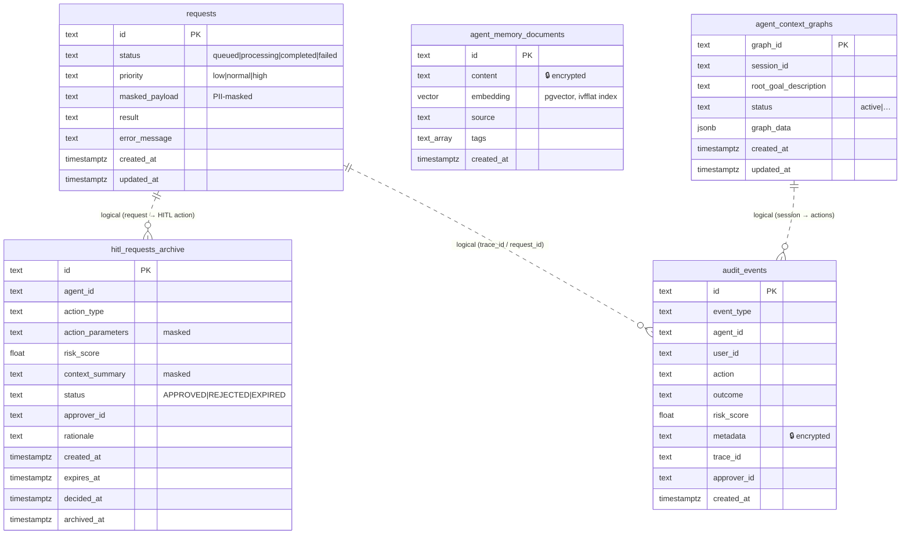

# Entity-Relationship Diagram

> **Owner:** Tech Lead + DPO | **Authoritative schema:** `alembic/versions/` | **Companion:** [`data-model-catalog.md`](data-model-catalog.md)

The persisted PostgreSQL entities. The tables are **intentionally not joined by database foreign
keys** — services are loosely coupled and reference each other by id (`request_id`, `agent_id`,
`session_id`) across event boundaries, not by enforced FKs. The relationships below are therefore
**logical**, not physical constraints. Columns marked 🔒 are encrypted at rest (AES-256-GCM,
ADR-0018).

## Logical references (not enforced FKs)

| From                     | To             | Via                          | Notes                                                 |
| ------------------------ | -------------- | ---------------------------- | ----------------------------------------------------- |
| `hitl_requests_archive`  | `audit_events` | `request_id` / `approver_id` | every decision is audit-logged (ADR-0026)             |
| `agent_memory_documents` | `audit_events` | `agent_id`                   | rejections recorded as memory (ADR-0017, bug history) |
| `requests`               | `audit_events` | `trace_id`                   | request lifecycle traced end-to-end                   |

## Indexes (from migrations)

| Table                    | Index                                                                  | Columns                                          |
| ------------------------ | ---------------------------------------------------------------------- | ------------------------------------------------ |
| `audit_events`           | `ix_audit_events_type_created`, `ix_audit_events_agent_created`        | (event_type, created_at), (agent_id, created_at) |
| `agent_memory_documents` | `ix_agent_memory_embedding_ivfflat`, `ix_agent_memory_source_created`  | embedding (ivfflat), (source, created_at)        |
| `requests`               | `ix_requests_status_created`, `ix_requests_created`                    | (status, created_at), (created_at)               |
| `hitl_requests_archive`  | `ix_hitl_archive_status_created`, `ix_hitl_archive_agent_created`      | (status, created_at), (agent_id, created_at)     |
| `agent_context_graphs`   | `ix_agent_context_graphs_status`, `ix_agent_context_graphs_session_id` | (status), (session_id)                           |

> Regenerate this diagram when a migration adds/changes a table or column (same PR). The Mermaid
> block renders on GitHub and in MkDocs.
