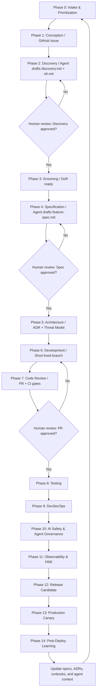

# Agentic Spec-Driven Delivery Workflow

> **Version:** 1.0.0 | **Last updated:** 2026-06-06 | **ADR:** ADR-0052, ADR-0058

This is the repository's reference model for delivering software with AI agents as
first-class contributors — from a product idea to post-deploy learning — without
discarding engineering discipline.

> **Agentic Spec-Driven Delivery is a modern SDLC operating model that replaces
> Gitflow-style release governance and reduces ceremony-heavy workflows, while
> preserving Agile principles: fast feedback, customer collaboration, iterative
> delivery, and continuous learning.**

The core idea:

> **AI agents draft, analyze, test, explain, and recommend. Humans approve, own,
> and operate.** Agents do not bypass engineering discipline — they accelerate it.

---

## Why this replaces Gitflow but not Agile

Gitflow is a **branching and release-management strategy**; Agile is a **product and
collaboration mindset**. This workflow replaces heavyweight long-lived branches and
fragmented delivery gates with short-lived branches + controlled, mostly-automated
gates. It keeps Agile's learning loops (iterative delivery, fast feedback,
retrospectives, continuous improvement). It is **not** more bureaucracy — it makes
AI-assisted delivery faster, safer, observable, reviewable, and continuously
improvable.

---

## The lifecycle (risk-based)

The full lifecycle is **15 phases (0–14)**. It is adaptive: low-risk work takes a
short path; high-impact work passes the full set of gates. The detailed, operational
phase reference (actors, steps, outputs, blocking gates) lives in
[`docs/process/WORKFLOW.md`](../process/WORKFLOW.md); the machine-readable gate
contracts live in [`docs/process/gates/phase-gates.yaml`](../process/gates/phase-gates.yaml).

| Phase | Name                         | Primary output                                                                                                       |
| ----- | ---------------------------- | -------------------------------------------------------------------------------------------------------------------- |
| 0     | Intake & Prioritization      | Problem statement, value hypothesis, risk class, owner                                                               |
| 1     | Conception                   | GitHub Issue (`feature_request` template)                                                                            |
| 2     | Discovery                    | Agent-drafted `discovery.md` + `nfr.md`; human review via Spec-as-PR                                                 |
| 3     | Grooming                     | DoR checklist, acceptance criteria, dependencies, risk level; `status: ready`                                        |
| 4     | Specification                | Agent-drafted `feature-spec.md`, test strategy, edge cases; Spec-as-PR                                               |
| 5     | Architecture                 | ADR (if a decision is required); threat model (if security/privacy/AI risk)                                          |
| 6     | Development                  | Short-lived branch; agent-assisted implementation against the approved spec                                          |
| 7     | Code Review                  | PR review, DoD checklist, CI gates; **required human approval**                                                      |
| 8     | Testing                      | Unit, integration, contract, regression, performance, abuse-case tests                                               |
| 9     | DevSecOps                    | SAST, SCA, secrets, Trivy, SBOM, DAST, IaC scan, signing, provenance                                                 |
| 10    | AI Safety & Agent Governance | Prompt-injection tests, tool-permission review, data-leakage checks, evals, auditability _(AI/LLM/agentic features)_ |
| 11    | Observability & Readiness    | OTel spans, metrics, logs, SLOs, alerts, runbooks; **PRR sign-off**                                                  |
| 12    | Release Candidate            | DoR-Release checklist, `rc-approved` label, environment protection                                                   |
| 13    | Production                   | Canary 5% → 25% → 100%, GitHub Release tag, automated rollback criteria                                              |
| 14    | Post-Deploy Learning         | DORA metrics, incident learnings, feedback, retrospectives → update specs/ADRs/runbooks/agent context                |



---

## Risk-based flow

Do **not** force every change through all 15 phases. Match the path to the risk class
(assigned at Phase 0):

| Change type                    | Recommended path                                                               |
| ------------------------------ | ------------------------------------------------------------------------------ |
| Small bug fix                  | Issue → PR → CI/security → deploy → observe                                    |
| Normal feature                 | Discovery → Spec → Dev → Review → Test → Release                               |
| High-risk feature              | Full lifecycle with architecture, security, observability, and release gates   |
| AI/LLM/agentic feature         | Full lifecycle **plus** the AI Safety & Agent Governance gate (Phase 10)       |
| Security-sensitive change      | Full lifecycle **plus** threat model, stricter approval, enhanced auditability |
| Infrastructure/platform change | Full lifecycle **plus** rollback plan, PRR, operational readiness review       |

Team-size adoption tiers (what to activate vs. skip) are in
[`CUSTOMISING.md §8`](../../CUSTOMISING.md).

---

## Agent participation model

Agents are contributors, not decision owners.

| Phase         | Agent contribution                                               | Human responsibility                      |
| ------------- | ---------------------------------------------------------------- | ----------------------------------------- |
| Discovery     | Draft discovery notes, assumptions, NFRs, risks                  | Validate problem, scope, business value   |
| Specification | Draft feature spec, edge cases, acceptance criteria              | Approve requirements and trade-offs       |
| Architecture  | Suggest ADR options and consequences                             | Choose architecture and own the decision  |
| Development   | Generate code, tests, migrations, docs                           | Review, adapt, commit, own implementation |
| Testing       | Generate tests and abuse cases                                   | Approve coverage and quality level        |
| DevSecOps     | Explain findings, suggest remediation                            | Accept, mitigate, or block risk           |
| AI Safety     | Run evals, injection/leakage tests, draft tool-permission review | Approve agent boundaries and autonomy     |
| Observability | Suggest metrics, spans, alerts, runbooks                         | Confirm SLOs and operational readiness    |
| Release       | Summarize release risk and readiness                             | Approve RC and production rollout         |
| Post-Deploy   | Analyze DORA metrics, incidents, regressions                     | Decide improvement actions                |

> Agents may recommend. Humans approve. Production remains human-accountable.

At **runtime**, this is enforced by the HITL/HOTL gateway and the autonomy levels
(see [`docs/process/HITL-GOVERNANCE.md`](../process/HITL-GOVERNANCE.md) and ADR-0011,
ADR-0053). The two governance tiers:

- **Spec-as-PR** — pre-code artefacts (discovery, NFR, spec, ADR) are reviewed via
  GitHub PR; human review is the HITL equivalent for the spec phase.
- **Runtime gateway** — agent actions with real-world effects route through
  `src/agents/hitl_gateway.py`.

---

## Required human gates

Mandatory human review boundaries:

1. **Discovery approval** before specification starts.
2. **Specification approval** before implementation starts.
3. **Architecture approval** when an ADR or threat model is required.
4. **Code review approval** before merge.
5. **Security approval** for high/critical findings.
6. **AI governance approval** for AI/LLM/agentic capabilities.
7. **Production readiness approval** (PRR) before release-candidate promotion.
8. **Release approval** before canary rollout.
9. **Post-deploy review** after rollout completion.

Role accountability per phase: [`docs/process/RACI.md`](../process/RACI.md).

---

## Gates & checklists

| Gate                                | Where                                                                                  |
| ----------------------------------- | -------------------------------------------------------------------------------------- |
| Definition of Ready (DoR)           | [`docs/process/DEFINITION_OF_READY.md`](../process/DEFINITION_OF_READY.md)             |
| Definition of Done (DoD)            | [`docs/process/DEFINITION_OF_DONE.md`](../process/DEFINITION_OF_DONE.md)               |
| Definition of Release (DoR-Release) | [`docs/process/DEFINITION_OF_RELEASE.md`](../process/DEFINITION_OF_RELEASE.md)         |
| AI Safety & Agent Governance        | [`docs/ai-governance/ai-safety-checklist.md`](../ai-governance/ai-safety-checklist.md) |
| Production Readiness Review (PRR)   | [`docs/sre/prr/PRR-TEMPLATE.md`](../sre/prr/PRR-TEMPLATE.md)                           |
| Machine-readable phase gates        | [`docs/process/gates/phase-gates.yaml`](../process/gates/phase-gates.yaml)             |

---

## DevSecOps & supply-chain integrity

Security controls are automated by default; **risk acceptance must remain explicit,
reviewed, and traceable**. The pipeline enforces: SAST (Bandit/gosec/SpotBugs), SCA
(pip-audit/OWASP dep-check), secret scanning (detect-secrets), container scanning
(Trivy), IaC scanning (Checkov), DAST (OWASP ZAP), SBOM (Syft/CycloneDX),
image/artifact signing + SLSA provenance (Cosign), branch protection + required
status checks, protected deployment environments, release-approval policy, and
rollback criteria. See `skills/devsecops/` and ADR-0056.

---

## Observability & production readiness

> A feature is not production-ready until the team can **observe, diagnose, and
> safely roll back** it.

Each production-impacting feature defines: the critical user journey impacted, golden
signals affected, SLIs/SLOs, required logs/traces/metrics, dashboard + runbook
updates, and rollback indicators. See `skills/sre/` and `docs/sre/`.

---

## Release model

Short-lived branches with controlled gates — not Gitflow long-lived branches:

```text
main
 ├── short-lived feature branch
 ├── pull request with required checks
 ├── merge after approval
 ├── release candidate label/tag
 ├── staging validation
 ├── canary production rollout (5% → 25% → 100%)
 └── GitHub Release tag
```

Rollback is automatic or semi-automatic when SLO, error-rate, latency, or
business-critical indicators breach defined thresholds (see ADR-0056,
`.github/workflows/cd-production.yml`).

---

## Metrics — is this helping or just adding process?

| Metric                         | Purpose                                           |
| ------------------------------ | ------------------------------------------------- |
| Lead time for change           | Speed from idea/spec to production                |
| Deployment frequency           | Delivery cadence                                  |
| Change failure rate            | Production quality                                |
| Time to restore service (MTTR) | Resilience after failure                          |
| PR review time                 | Flow efficiency                                   |
| Spec review time               | Discovery/spec bottlenecks                        |
| Security finding recurrence    | Whether vulnerabilities are learned from          |
| Escaped defects                | Quality after release                             |
| Rollback frequency             | Release stability                                 |
| Cognitive-load feedback        | Whether the workflow helps or overwhelms the team |

The first four are the [DORA](../glossary.md) metrics, tracked per ADR-0028; the rest
guard against the workflow becoming bureaucracy.

---

## Automating the workflow with Claude Code agents

This workflow can be **driven** by a Claude Code multi-agent system: an orchestrator
(`asdd-orchestrator`) sequences 15 phase subagents (`asdd-phase-0-intake` …
`asdd-phase-14-post-deploy`) in [`.claude/agents/`](../../.claude/agents/README.md).
Each subagent owns one phase, validates its inputs, produces a persisted artifact, and
emits a structured handoff ([schema](agent-handoff-schema.md)); the orchestrator handles
retries, applies the risk-based flow, and **stops at the mandatory human gates**. These
are dev-time delivery agents — distinct from the runtime product agents in `src/agents/`.

## See also

- [`.claude/agents/README.md`](../../.claude/agents/README.md) + [agent handoff schema](agent-handoff-schema.md) — the Claude Code delivery-agent system
- [`docs/process/WORKFLOW.md`](../process/WORKFLOW.md) — detailed per-phase operational reference
- [`docs/process/HITL-GOVERNANCE.md`](../process/HITL-GOVERNANCE.md) — two-tier HITL governance
- [`docs/process/RACI.md`](../process/RACI.md) — role accountability
- [`docs/process/SPRINT-TRACKING.md`](../process/SPRINT-TRACKING.md) — GitHub Issues + Projects
- [`docs/process/RETROSPECTIVE-GUIDE.md`](../process/RETROSPECTIVE-GUIDE.md) — learning loops
- ADR-0052 (E2E workflow), ADR-0058 (this delivery model), ADR-0053/0054/0055 (runtime governance)
