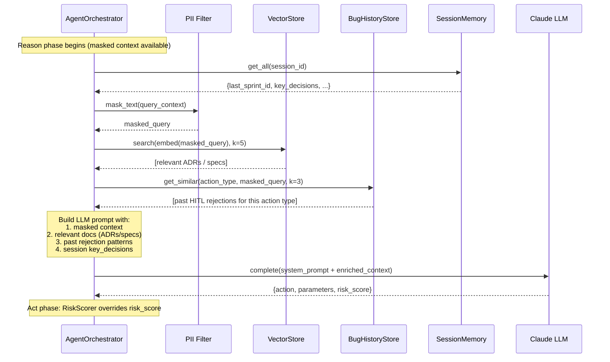

# Spec: Agent Persistent Memory

**ID:** SPEC-agent-memory
**Status:** Accepted
**Version:** 1.0.0
**Date:** 2026-05-27
**Authors:** Tech Lead, DPO
**ADR:** ADR-0017 (Agent Memory Architecture)
**DPIA:** `docs/privacy/dpia/dpia-agent-memory.md` — **review required before merge**

---

## 1. Purpose

Provide agents with recall across sessions via three complementary layers:

| Layer           | Technology            | Scope                               | TTL           |
| --------------- | --------------------- | ----------------------------------- | ------------- |
| Semantic memory | PostgreSQL + pgvector | Specs, ADRs, past outcomes          | 90 days       |
| Session cache   | Redis                 | Active sprint context (per session) | 24 h (config) |
| Bug history     | pgvector + audit      | HITL rejection patterns             | 90 days       |

**Use cases:**

1. Agent recalls a relevant ADR before proposing an architectural decision
2. Agent retrieves similar past HITL rejections before repeating a risky action
3. Harness coordinator stores current sprint context for context-reset continuity

---

## 2. PII Constraints (mandatory)

> ⚠️ **All writes to any memory layer MUST pass `pii_filter.mask_text()` or
> `pii_filter.mask_dict()` before persisting. No raw PII may enter the vector
> store, session cache, or bug history store.**

- Embeddings are computed from PII-masked text only
- Agent IDs (UUIDs) are L3_INTERNAL — allowed in memory
- User IDs may appear as masked tokens (`[USER_ID]`) only
- DPIA compliance: every new memory write category requires DPO sign-off

---

## 3. Components

### 3.1 VectorStore

**Purpose:** Semantic similarity search over indexed documents.

```python
@dataclass
class VectorDocument:
    id: str
    content: str              # pii_filter applied before storage
    embedding: list[float]    # provider-agnostic; dimension set by embedder
    source: str               # "spec" | "adr" | "hitl_rejection" | "sprint_outcome"
    tags: list[str]
    created_at: datetime

class VectorStore(Protocol):
    async def upsert(self, doc: VectorDocument) -> str
    async def search(self, query_embedding: list[float], k: int = 5) -> list[VectorDocument]
    async def delete(self, doc_id: str) -> None
```

**Implementations:** `InMemoryVectorStore` (tests/dev), `PostgresVectorStore` (production).

**Embedder protocol:**

```python
class Embedder(Protocol):
    async def embed(self, text: str) -> list[float]
```

**Implementations:** `StubEmbedder` (tests), production embedder (caller-provided).

### 3.2 DocumentIndexer

**Purpose:** Scans `specs/` and `docs/adr/` directories and upserts each file
as a `VectorDocument`, enabling agents to recall spec and ADR content by similarity.

```python
class DocumentIndexer:
    async def index_file(self, path: Path) -> VectorDocument
    async def index_directory(self, directory: Path, glob: str = "**/*.md") -> list[VectorDocument]
    async def index_all(self) -> int  # indexes specs/ + docs/adr/; returns count
```

**Triggered by:**

- GitHub Action on push to `main` (`.github/workflows/index-docs.yml`)
- Manual CLI: `make memory-index`

### 3.3 SessionMemory

**Purpose:** Short-term Redis-backed key-value store scoped to an agent session.

```python
class SessionMemory:
    async def set(self, session_id: str, key: str, value: Any, ttl_seconds: int | None) -> None
    async def get(self, session_id: str, key: str) -> Any | None
    async def get_all(self, session_id: str) -> dict[str, Any]
    async def delete_session(self, session_id: str) -> None
```

**Default TTL:** `settings.memory_session_ttl_seconds` (default: 86400 = 24 h).

### 3.4 BugHistoryStore

**Purpose:** Records HITL rejection events as searchable vector documents so
future agents can retrieve similar past rejections before repeating risky actions.

```python
class BugHistoryStore:
    async def record_rejection(
        self,
        sprint_id: str,
        action_type: str,
        feedback: str,           # pii_filter applied before storage
        risk_score: float,
        agent_id: str,
    ) -> str                     # doc_id

    async def get_similar(
        self,
        action_type: str,
        context: str,            # pii_filter applied before embedding
        k: int = 3,
    ) -> list[VectorDocument]
```

---

## 4. Memory Recall Sequence

This diagram shows exactly when and how the orchestrator queries memory during
the Reason phase, answering the question: _is recall automatic, or explicit?_

**Answer:** Recall is explicit — the orchestrator calls `memory.search()` before
constructing the LLM prompt. The results are injected as context, not retrieved
by the LLM autonomously.



### When memory recall is skipped

- `harness_mode = solo` with no `VectorStore` injected — orchestrator falls back to
  LLM-only reasoning (no spec recall, no rejection history)
- `SessionMemory` returns empty — new session; orchestrator proceeds without prior context
- `BugHistoryStore` returns empty — no similar past rejections; no impact on action

### Injecting memory into the orchestrator

```python
orchestrator = AgentOrchestrator(
    agent_id="my-agent",
    audit_logger=audit,
    hitl_gateway=gateway,
    llm_client=llm,
    vector_store=vector_store,        # optional — enables spec/ADR recall
    bug_history_store=bug_history,    # optional — enables rejection pattern recall
    session_memory=session_memory,    # optional — enables session continuity
)
```

All three memory dependencies are optional. When absent, the orchestrator operates
without recall (equivalent to pre-memory behaviour).

---

## 5. Data Retention

- Vector store: 90 days from `created_at` (aligns with ADR-0013)
- Session cache: TTL-evicted by Redis automatically
- Deletion on data subject request: all documents where `agent_id` matches must
  be deleted within 15 days of receipt of erasure request

---

## 5. Observability

```
memory_vector_upserts_total{source}     counter
memory_vector_searches_total{source}    counter
memory_session_writes_total             counter
memory_session_reads_total              counter
memory_bug_history_records_total        counter
```

---

## 5b. Durable State Ledger (typed-ID) & Self-Pruning Archival

The three runtime layers above (§1) are _machine_ memory. This section adds a fourth, **document-
level** layer for **cross-session work state** an agent and a human both read: a durable
`STATE.md` ledger of typed, numbered entries, plus a transient `HANDOFF` checkpoint. It uplifts
(does not replace) the per-feature machine state in `docs/sdlc/agent-handoff-schema.md` /
`scripts/asdd_state.py` — that JSON is per-run delivery state; this is the durable decision/lesson
ledger that survives across sessions.

### Typed-ID ledger — `docs/product/FEAT-{id}/STATE.md`

Durable, append-mostly, cross-session. Each entry has a **typed, numbered ID** so it can be cited
(e.g. "per `L-007`") from specs, ADRs, PRs, and later agent reasoning:

| Prefix   | Zone            | Meaning                                                                          |
| -------- | --------------- | -------------------------------------------------------------------------------- |
| `AD-NNN` | Decisions       | A decision made during delivery + its rationale (pre-ADR or local)               |
| `B-NNN`  | Blockers        | An open/closed blocker; closed ones keep a resolution note                       |
| `L-NNN`  | Lessons Learned | A reusable lesson — **first-class and citable** (feeds the §3.4 BugHistoryStore) |
| —        | Deferred Ideas  | Out-of-scope ideas captured so they are not lost                                 |
| —        | Todos           | Outstanding work items not yet promoted to GitHub Issues                         |

IDs are monotonic per type and never reused (a closed `B-003` stays `B-003`). PII constraints (§2)
apply to every ledger write — `pii_filter` runs before persistence, same as any memory layer.

### Self-pruning zones (keep the file from bloating context)

`STATE.md` carries a size indicator so it never silently bloats the per-phase context budget
(`docs/process/context-budget.md`, ADR-0060):

| Zone | Trigger                        | Action                                                                                                 |
| ---- | ------------------------------ | ------------------------------------------------------------------------------------------------------ |
| 🟢   | within budget                  | normal operation                                                                                       |
| 🟡   | approaching the file's ceiling | review; summarise verbose entries                                                                      |
| 🔴   | over ceiling                   | **archive** entries older than **60 days** (or any closed `B-`/superseded `AD-`) to `STATE-ARCHIVE.md` |

Archival **moves, never deletes** (consistent with `skills/sdlc/spec-lifecycle.md` — deprecate by
moving). `STATE-ARCHIVE.md` is `on_demand` context, never base-load.

### Durable `STATE` vs transient `HANDOFF`

| Aspect   | `STATE.md` (this section)               | `HANDOFF` (`docs/sdlc/agent-handoff-schema.md`)       |
| -------- | --------------------------------------- | ----------------------------------------------------- |
| Lifetime | **durable** — persists across sessions  | **transient** — overwritten each pause/resume         |
| Holds    | decisions, blockers, lessons, deferrals | "where we are, what's next" — a ~500-token checkpoint |
| Size     | budgeted + self-pruned (🟢/🟡/🔴)       | bounded small (≈ 500 tokens) by design                |

Keep the two separate: durable knowledge accretes in `STATE.md`; the resume checkpoint stays tiny
in the handoff message. The handoff schema documents the transient side of this split.

---

## 6. Acceptance Criteria

- [ ] `pii_filter.mask_text()` called before every write (enforced in implementation)
- [ ] `InMemoryVectorStore` supports cosine similarity search without external deps
- [ ] `SessionMemory` works with `fakeredis` in unit tests
- [ ] `DocumentIndexer.index_all()` indexes at least one `.md` file from `specs/`
- [ ] `BugHistoryStore.get_similar()` returns most semantically similar past rejections
- [ ] Unit test coverage ≥ 80%
- [ ] DPIA reviewed and signed by DPO before merge to main
