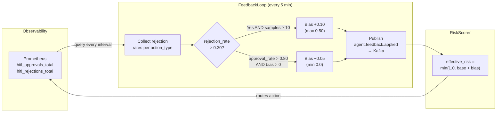

# Spec: Agent Feedback Loop (Telemetria → Comportamento)

**ID:** SPEC-feedback-loop
**Status:** Accepted
**Version:** 1.0.0
**Date:** 2026-05-26
**Authors:** Tech Lead
**GitHub Issue:** required before merge

---

## 1. Purpose

Fechar o ciclo entre observabilidade e comportamento de agentes: métricas coletadas
pelo Prometheus devem retroalimentar os thresholds de risco do HITL Gateway, tornando
o sistema auto-adaptativo em vez de operar com parâmetros estáticos para sempre.

---

## 2. Problema

O `hitl_risk_threshold` em `config.py` é um valor estático (default `0.4`). Se uma
categoria de ação (`action_type`) sistematicamente recebe rejeições humanas — sinal
de que o threshold está baixo para aquele tipo — o sistema não aprende isso. O ajuste
é manual e requer um deploy.

---

## 3. Solução

`src/agents/feedback_loop.py` — componente que:

1. **Consome métricas** do Prometheus via HTTP (endpoint `/metrics` ou PromQL)
2. **Calcula** a taxa de rejeição por `action_type` nas últimas N horas
3. **Ajusta** o `risk_score_bias` por `action_type` quando a taxa excede o limiar configurável
4. **Publica** o ajuste como evento Kafka no tópico `agent.feedback.applied`
5. **Expõe** as correções como métricas Prometheus para o dashboard Grafana

---

## 4. Arquitetura

```
Prometheus /metrics
        │
        ▼
FeedbackLoop.collect_rejection_rates()
        │
        ▼
FeedbackLoop.compute_adjustments()   ← compara com thresholds configuráveis
        │
        ├── publica → Kafka: agent.feedback.applied
        │
        └── armazena → risk_score_bias_overrides (dict in-memory + Redis)
                │
                ▼
        HITLGateway consulta FeedbackLoop.get_bias(action_type)
        antes de avaliar risk_score da ação
```

---

## 5. Regras de ajuste

| Condição                                                                                    | Ação                                             |
| ------------------------------------------------------------------------------------------- | ------------------------------------------------ |
| Taxa de rejeição de `action_type` > `feedback_rejection_threshold` (default 30%)            | Elevar `risk_score_bias` em +0.1 (capped a +0.5) |
| Taxa de aprovação de `action_type` > `feedback_approval_threshold` (default 80%) por 7 dias | Reduzir `risk_score_bias` em -0.05 (floor 0.0)   |
| Dados insuficientes (< `feedback_min_samples`, default 10)                                  | Sem ajuste — não penalizar ações raras           |

O `risk_score` efetivo enviado ao HITL é: `min(1.0, risk_score + get_bias(action_type))`

---

## 6. Métricas expostas

```python
agent_feedback_rejection_rate   # Gauge, labels: [action_type]
agent_feedback_bias_applied     # Gauge, labels: [action_type]
agent_feedback_adjustments_total  # Counter, labels: [action_type, direction]
```

---

## 7. Tópico Kafka: `agent.feedback.applied`

Publicado sempre que um ajuste é aplicado. Payload segue o `EventEnvelope` do AsyncAPI spec.
Campo `action_type` não pode conter PII (é um enum de tipos de ação, não dados de usuário).

---

## 8. Execução

O `FeedbackLoop` é executado como tarefa de background — inicializado no startup da aplicação
via `asyncio.create_task`. Intervalo configurável via `feedback_loop_interval_seconds` (default: 300s).

---

## 9. Control Loop Diagram



---

## 10. Convergence Contract

Convergence is reached when, for every `action_type` with ≥ 10 decisions, the bias
is stable for 3 consecutive cycles (no adjustment triggered).

**Example** — `send_notification` starting at 40% rejection rate:

| Cycle | Rejection rate | Bias | Effective risk | Routing              |
| ----- | -------------- | ---- | -------------- | -------------------- |
| 0     | 0.40           | 0.00 | 0.30           | HOTL                 |
| 1     | 0.40           | 0.10 | 0.40           | HITL                 |
| 2     | 0.35           | 0.20 | 0.50           | HITL                 |
| 4     | 0.10           | 0.15 | 0.45           | HITL                 |
| 6     | 0.05           | 0.05 | 0.35           | HOTL                 |
| 7     | 0.05           | 0.00 | 0.30           | HOTL — **converged** |

---

## 11. Rollback / Override

**Check current state:**

```bash
make agent-feedback-check
```

**Emergency freeze** (stop all adjustments without a deploy):

```bash
kubectl set env deployment/agent-service FEEDBACK_LOOP_INTERVAL_SECONDS=999999
# Biases freeze at current values. Restore with:
kubectl set env deployment/agent-service FEEDBACK_LOOP_INTERVAL_SECONDS=300
```

**Reset all biases to zero** (e.g. after a model update):

```bash
kubectl set env deployment/agent-service FEEDBACK_BIAS_MAX=0
# After one cycle, all biases decay to 0. Then restore:
kubectl set env deployment/agent-service FEEDBACK_BIAS_MAX=0.5
```

Document any manual override in a postmortem entry under `docs/postmortems/`.

---

## 12. Aceitação

- [ ] `FeedbackLoop.run_once()` retorna lista de `BiasAdjustment` sem lançar exceções
- [ ] Bias aplicado quando taxa de rejeição > threshold
- [ ] Sem ajuste quando amostras < `feedback_min_samples`
- [ ] Evento Kafka publicado a cada ajuste
- [ ] Bias máximo capped a +0.5
- [ ] Bias mínimo floored a 0.0
- [ ] Unit test coverage ≥ 80%
