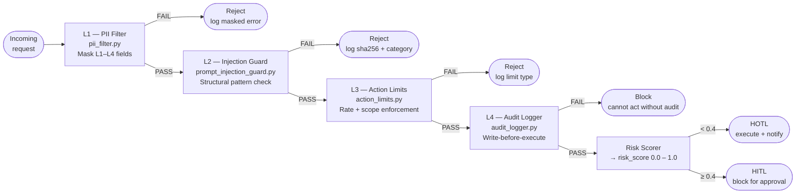

# Guardrails Spec

**Status:** Approved | **Owner:** Security Lead | **Last updated:** 2026-05-24
**ADR references:** ADR-0012 (PII Masking), ADR-0011 (HITL/HOTL)

---

## Overview

Four mandatory guardrail layers protect the agent at runtime. All four must pass before any action executes. Guardrails are **not optional** and have no bypass path.

---

## Guardrail Layers

### Layer 1 — PII Filter (`src/guardrails/pii_filter.py`)

Masks personally identifiable information before it reaches the LLM, any log, or any event broker.

**Mandatory interception points (ADR-0012):**

1. Pre-LLM call — masks agent context before prompt construction
2. Pre-log write — masks all structured log fields
3. Pre-broker publish — masks event payload before Kafka produce

**Classification and masking tokens:**

| PII Level | Examples                     | Mask token                   |
| --------- | ---------------------------- | ---------------------------- |
| L1        | CPF, SSN, health records     | `[CPF]`, `[CARD]`            |
| L2        | Email, full name, IP address | `[EMAIL]`, `[PHONE]`, `[IP]` |
| L3        | User ID, session token       | `[TOKEN]`, `[UUID]`          |
| L4        | Public information           | Pass through                 |

**Detection approach:** format-based pattern matching on field names and structural validation of field values. Detection logic never stores, reproduces, or forwards the matched value — only the replacement token.

**Failure mode:** If the filter raises an exception, the request is rejected. Unmasked data never passes through to the next layer.

---

### Layer 2 — Prompt Injection Guard (`src/guardrails/prompt_injection_guard.py`)

Detects and rejects inputs that attempt to override agent instructions or manipulate reasoning.

**Detection categories (structural, not by example):**

- Instruction override attempts (role re-assignment patterns)
- System prompt boundary violations
- Context confusion patterns (encoded or escaped instruction sequences)
- Chain-of-thought hijacking patterns

**Behaviour on detection:**

- Reject the request immediately
- Log: `sha256(input)[:16]` + rejection category + timestamp (never the raw input)
- Increment `guardrail_injections_detected_total{category}` metric
- Return sanitised error to caller (no information about detection logic)

**Failure mode:** On guard error, default to REJECT. Never pass through on uncertainty.

---

### Layer 3 — Action Limits (`src/guardrails/action_limits.py`)

Enforces rate limits and scope restrictions on all agent actions.

**Rate limit defaults (configurable per agent):**

| Limit type          | Default     | Scope        |
| ------------------- | ----------- | ------------ |
| Actions per hour    | 100         | Per agent_id |
| Actions per day     | 500         | Per agent_id |
| Bulk operation size | 50 entities | Per action   |
| External API calls  | 200/hour    | Per agent_id |

**Scope restrictions:**

- Agent may only act on resources in its declared scope (set at agent init time)
- Cross-scope operations are rejected regardless of HITL approval
- Scope cannot be expanded at runtime — requires config change and restart

**Failure mode:** On limit check error, reject the action. Limits are not bypassed on uncertainty.

---

### Layer 4 — Audit Logger (`src/guardrails/audit_logger.py`)

Records every agent decision immutably before the action executes.

**Write-before-execute invariant:** The audit record is written and confirmed **before** the action is dispatched. If the audit write fails, the action is blocked.

**Record schema:**

```json
{
  "event_id": "<uuid>",
  "agent_id": "<string>",
  "action_type": "<string>",
  "action_params_hash": "<sha256>",
  "risk_score": "<float>",
  "guardrails_passed": ["pii_filter", "injection_guard", "action_limits"],
  "oversight_mode": "HITL|HOTL",
  "outcome": "<string>",
  "timestamp": "<ISO8601>",
  "trace_id": "<string>"
}
```

Note: `action_params_hash` is the SHA-256 of the masked params. Raw params are never stored.

---

### Layer 5 — Output Sanitizer (`src/guardrails/output_sanitizer.py`)

The OUTPUT-side complement to the input-side Injection Guard (Layer 2). It sanitizes
**LLM-generated output** before it is rendered (HITL operator UI, logs) or could reach an execution
sink (OWASP **LLM02** / **LLM05**, CLAUDE.md §3.2). It **strengthens, never replaces**, Layer 2.

**Three transforms:**

- **Strip control characters** — remove C0/C1 control chars (except tab/newline/CR) that can spoof
  terminals, corrupt logs, or hide content.
- **Escape markup** — HTML-escape active markup. **Render contexts only.**
- **Detect code-exec sinks** — flag active-content / code-execution patterns (`eval(`/`exec(`,
  `__import__`, unsafe deserialization, `os.system`/`subprocess`, `<script>`, inline event
  handlers, `javascript:` / `data:text/html` URIs, shell `$(...)`/backticks, `{{...}}`/`${...}`
  template injection).

**Render vs execute (invariant):** markup-escaping is correct for _render_ but would **corrupt**
values that are later _executed_. So on the execution path the sanitizer strips control chars and
detects sinks but does **not** escape (`escape=False`); render consumers escape at display time
(`escape=True`). Escaping an executable parameter value is a defect.

**Where it runs:** the orchestrator **Act** step (`_act_inner`), on the proposed action's parameters,
before action-limit checks, audit write, or execution. Telemetry: `act.output_sanitized`,
`act.output_control_chars_stripped`, `act.output_sinks_detected` span attributes + an
`output_sanitizer.modified` structured log.

**Sink → HITL (the safe "block"):** if the LLM output contains a code-exec / active-content sink,
the action is **never executed autonomously** — it is routed to HITL (`oversight_mode =
HITL_OUTPUT_SINK`), regardless of risk score or autonomy ceiling.

---

## Guardrail Execution Order

```
Incoming request
      │
      ▼
[L1] PII Filter ──── FAIL → Reject (log masked error)
      │
      ▼
[L2] Injection Guard ── FAIL → Reject (log hash + category)
      │
      ▼
[L3] Action Limits ── FAIL → Reject (log limit type)
      │
      ▼
[L4] Audit Write ──── FAIL → Block (cannot act without audit)
      │
      ▼
 Risk Scorer → HITL / HOTL routing
      │
      ▼
 Execute action
```



---

## Observability

| Metric                                          | Type    | Labels                         |
| ----------------------------------------------- | ------- | ------------------------------ |
| `guardrail_checks_total{layer, outcome}`        | Counter | layer=L1–L4, outcome=pass/fail |
| `guardrail_injections_detected_total{category}` | Counter | category=structural category   |
| `guardrail_pii_fields_masked_total{level}`      | Counter | level=L1–L4                    |
| `guardrail_action_limit_exceeded_total{type}`   | Counter | type=hourly/daily/bulk         |
| `guardrail_audit_write_failures_total`          | Counter | —                              |

Alerts:

- `GuardrailAuditWriteFailure` — any audit write failure → P1 immediately
- `GuardrailInjectionSpike` — injection detections > 10/min → P2

---

## Testing Requirements

All guardrail components require:

- Unit tests with 100% branch coverage on decision paths
- Tests using **only** synthetic placeholder tokens and clearly fake data
- Security regression tests gating every PR (CI must pass before merge)
- Quarterly red-team exercise documented in `docs/postmortems/`
