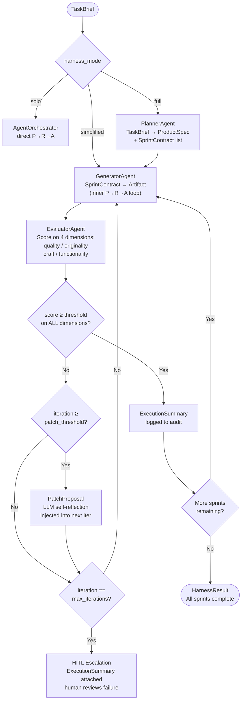

# Harness Design Spec

**Status:** Approved | **Owner:** AI Lead | **Last updated:** 2026-05-24
**ADR references:** ADR-0014 (Multi-Agent Harness Strategy), ADR-0010 (Agent Framework), ADR-0011 (HITL/HOTL)

---

## Overview

This spec defines the multi-agent harness that coordinates long-running, complex tasks
beyond the capability of a single Perception → Reason → Act loop. The harness introduces
three specialised agents (Planner, Generator, Evaluator) orchestrated by a Coordinator,
with an explicit context management strategy for multi-hour sessions.

**Reference:** Anthropic Engineering — "Harness Design for Long-Running Application Development" (2025).

---

## 1. Agent Roles & Interfaces

### 1.1 PlannerAgent

**Purpose:** Converts a brief user description into a structured product specification
and a prioritised list of sprint contracts. Avoids technical over-specification.

```
Input:  TaskBrief
Output: ProductSpec (contains []SprintContract)
```

**Prompt engineering invariants:**

- Focus on scope ambition, not implementation details
- Each sprint contract must have independently testable success criteria
- Surface AI feature opportunities explicitly
- Do NOT pre-select technology choices unless the brief demands it

**Safety gates (in order):**

1. `pii_filter.mask_dict()` on `TaskBrief.description`
2. `injection_guard.validate()` on masked description
3. `audit_logger.log_event()` with `action = "plan_generated"` before returning

### 1.2 GeneratorAgent

**Purpose:** Implements one sprint contract at a time, producing typed artifacts.
Delegates to the existing `AgentOrchestrator` P→R→A loop internally.

```
Input:  SprintContract
Output: GeneratorArtifact
```

**Invariants:**

- Negotiates contract with Evaluator _before_ implementation begins
- Uses git-structured commits when producing code artifacts
- Passes PII filter on all artifact content before handing off

### 1.3 EvaluatorAgent

**Purpose:** External quality gate. Scores generator output against the sprint contract
using four dimensions. Operates with explicit skepticism — its default assumption is that
the implementation is incomplete or defective.

```
Input:  SprintContract + GeneratorArtifact
Output: EvaluatorScore
```

**Four grading dimensions:**

| Dimension       | What it measures                                           |
| --------------- | ---------------------------------------------------------- |
| `quality`       | Functional coherence and completeness against the spec     |
| `originality`   | Evidence of deliberate choices vs. template defaults       |
| `craft`         | Technical execution: error handling, edge cases, structure |
| `functionality` | Each success criterion met independently and verifiably    |

**Skepticism rules (anti-leniency — enforced in system prompt):**

- Default assumption: the implementation has defects
- Each `success_criteria` item must be verified independently — not inferred from code review
- "This looks like it would work" → `passed = False`
- "This demonstrably works when I verify criterion X" → may contribute to `passed = True`
- Score below `settings.harness_evaluator_pass_threshold` on any dimension → `passed = False`

**Safety gates:**

- `audit_logger.log_event()` with `action = "evaluation_completed"` and all four scores in metadata
- OTel span `evaluator.completed` with `passed`, `iteration`, `score.*` attributes

### 1.4 HarnessCoordinator

**Purpose:** Selects the harness mode for a given task and orchestrates the agent pipeline.

```
Input:  TaskBrief
Output: HarnessResult
```

**Mode selection logic:**

```python
match settings.harness_mode:
    case "solo":       run P→R→A orchestrator directly
    case "simplified": Generator + Evaluator (no Planner)
    case "full":       Planner → Generator → Evaluator
```

**Retry loop (full and simplified modes):**

```
for sprint in product_spec.sprint_contracts:
    for iteration in range(settings.harness_max_iterations):
        artifact = generator.generate(sprint)
        score    = evaluator.evaluate(sprint, artifact)
        if score.passed:
            break
        if iteration == max_iterations - 1:
            escalate_to_hitl(sprint, score)   # human reviews after max retries
```

---

## 2. Sprint Contract Schema

Sprint contracts are the formal agreement between Planner (or user) and Generator
on what constitutes a complete, verifiable unit of work.

```python
@dataclass
class SprintContract:
    sprint_id: str                  # UUID v4
    objectives: list[str]           # what the user experiences (non-technical)
    success_criteria: list[str]     # testable, binary, specific
```

**Writing rules for `success_criteria`:**

- Each criterion must be independently testable (no "and" clauses)
- Each criterion must be binary: pass or fail, not "mostly works"
- Avoid implementation language: "user can submit the form" not "POST /api/form returns 200"

**Example:**

```yaml
sprint_id: "sprint-003-level-editor"
objectives:
  - "Users can create and save custom game levels"
  - "Saved levels persist across sessions"
success_criteria:
  - "Creating a level with at least one element and saving it produces a non-empty save file"
  - "Loading a previously saved level restores all elements to their original positions"
  - "Attempting to save an empty level shows an error message to the user"
  - "Level editor is accessible from the main menu without restarting the application"
```

**Negotiation protocol:**

1. Generator proposes the contract (derived from `ProductSpec`)
2. Evaluator reviews and may request clarification or tighten criteria
3. Both agents confirm contract before implementation begins
4. Contract is immutable once confirmed — changes require a new sprint

---

## 3. Context Management Strategy

Long-running harness sessions face two failure modes: context exhaustion
(incoherence as window fills) and context anxiety (premature task wrap-up).
The `ContextManager` addresses both.

### 3.1 Compaction (intra-agent, default)

When a single agent's context grows large but has not yet hit the reset threshold:

- Summarise prior turns into a structured `key_decisions` list
- Preserve continuity — the agent retains its reasoning chain
- Triggered automatically by the agent runtime; no explicit snapshot needed

### 3.2 Reset (inter-agent boundaries)

When `context_utilisation >= settings.harness_context_reset_threshold` (default: 0.85):

- Build a `ContextSnapshot` from the current masked agent state
- Clear the context window entirely
- Inject the snapshot as a compact system message in the new context
- The next agent (or next iteration) resumes from the snapshot

**ContextSnapshot invariants:**

- `masked_state` must have PII filtered before snapshot creation — caller's responsibility
- `key_decisions` is a flat list of strings, ≤ 20 items, each ≤ 200 characters
- Snapshot is written to `audit_logger` before context is cleared

### 3.3 Threshold tuning

| Scenario                      | Recommended threshold    |
| ----------------------------- | ------------------------ |
| Default (Opus 4.6+)           | 0.85                     |
| Older models / large contexts | 0.70                     |
| Debug / disable resets        | 1.01 (effectively never) |

---

## 4. Structured Handoff Model

At every inter-agent boundary, a typed handoff payload is passed. This prevents
silent state loss and ensures each agent starts with sufficient context.

```python
@dataclass
class ContextSnapshot:
    agent_id: str
    created_at: str           # ISO8601 UTC
    task_id: str
    last_sprint_id: str | None
    key_decisions: list[str]  # max 20 items
    masked_state: dict        # no raw PII — enforced by ContextManager
```

**Restore prompt template (injected as system message after reset):**

```
You are resuming a task. Context summary:
- Task ID: {task_id}
- Last completed sprint: {last_sprint_id}
- Key decisions made so far:
  {key_decisions formatted as bullet list}
- Current state: {masked_state as JSON}
Continue from where the previous context left off.
```

---

## 5. Harness Modes

### Sprint Loop Diagram



---

### 5.1 solo

- Bypasses all harness agents
- Routes directly to `AgentOrchestrator.run()`
- Use for: single-step tasks, low-complexity requests, latency-sensitive flows
- Cost multiplier: 1×

### 5.2 simplified

- Activates Generator + Evaluator; skips Planner
- No sprint decomposition — treat the entire brief as one sprint
- Recommended for: Opus 4.6+ on feature-level tasks (empirically: 2–4 hour sessions)
- Cost multiplier: ~5–10×

### 5.3 full

- Activates Planner + Generator + Evaluator with sprint decomposition
- Required for: tasks spanning multiple features, multi-hour sessions, tasks where
  scope ambiguity is high
- Cost multiplier: ~15–25×

**Mode selection heuristic:**

| Task description length       | Estimated duration | Recommended mode |
| ----------------------------- | ------------------ | ---------------- |
| 1–2 sentences, clear scope    | < 20 min           | `solo`           |
| 3–6 sentences, moderate scope | 30 min – 2 h       | `simplified`     |
| > 6 sentences or vague scope  | 2 h+               | `full`           |

---

## 6. HITL Integration Points

The harness integrates with `src/agents/hitl_gateway.py` at two points:

### 6.1 Planner output review (optional)

When `TaskBrief.complexity == "high"`, the `ProductSpec` may be routed to HITL
for human review before sprint execution begins. A human reviewer can:

- Approve the spec as-is → begin sprint loop
- Modify sprint contracts → begin sprint loop with changes
- Reject the spec → return to Planner with feedback

This gate is controlled by `settings.harness_planner_hitl_review: bool = False`
(opt-in, disabled by default to preserve automation throughput).

### 6.2 Evaluator exhaustion escalation (mandatory)

When the evaluator scores below `harness_evaluator_pass_threshold` after
`harness_max_iterations` retries, the harness **must** escalate to HITL:

```
HITLRequest payload:
  - sprint_contract (full text)
  - last GeneratorArtifact
  - last EvaluatorScore (with all four dimension scores and feedback)
  - iteration count
```

A human reviewer decides:

- Approve with manual override → mark sprint passed, continue
- Provide additional context → re-inject into generator and retry
- Reject sprint → mark task failed, stop harness

**Audit invariant:** every HITL escalation is logged via `audit_logger.log_event()`
with `action = "harness_hitl_escalation"` and `outcome = "PENDING"` before routing.

---

## 7. Observability

Every harness operation emits OTel spans and Prometheus metrics:

### OTel span attributes

| Span name            | Key attributes                                                                                                            |
| -------------------- | ------------------------------------------------------------------------------------------------------------------------- |
| `planner.run`        | `task_id`, `sprint_count`, `duration_ms`                                                                                  |
| `generator.run`      | `task_id`, `sprint_id`, `iteration`, `duration_ms`                                                                        |
| `evaluator.run`      | `task_id`, `sprint_id`, `iteration`, `passed`, `score.quality`, `score.craft`, `score.functionality`, `score.originality` |
| `context.reset`      | `task_id`, `agent_id`, `utilisation_pct`                                                                                  |
| `harness.escalation` | `task_id`, `sprint_id`, `final_iteration`                                                                                 |

### Prometheus metrics

```
harness_iterations_total{mode, sprint_id, outcome}       counter
harness_evaluator_score{dimension}                       histogram (buckets: 0.1 steps)
harness_context_resets_total{agent_id}                   counter
harness_sprint_duration_seconds                          histogram
harness_total_cost_usd                                   gauge
```

---

## 8. Implementation Reference

| Component           | File                                         |
| ------------------- | -------------------------------------------- |
| Domain models       | `src/agents/harness/models.py`               |
| Context manager     | `src/agents/harness/context_manager.py`      |
| Planner agent       | `src/agents/harness/planner.py`              |
| Evaluator agent     | `src/agents/harness/evaluator.py`            |
| Decision logger     | `src/agents/harness/decision_tree_logger.py` |
| Harness coordinator | `src/agents/harness/coordinator.py`          |
| Harness skill       | `skills/ai/harness.md`                       |
| Config fields       | `src/shared/config.py` (harness\_\* fields)  |
| Unit tests          | `tests/unit/agents/harness/`                 |
| Integration tests   | `tests/integration/test_harness_pipeline.py` |

---

## 9. Self-Reflection & Auto-Correction

When repeated evaluator failures signal a systematic implementation error, the harness
applies structured self-reflection before the final retry — avoiding pure repetition
of the same failed approach.

### 9.1 Decision Tree Logging

Every branching decision made during sprint execution is recorded as a `DecisionPoint`
and written to the audit log via `DecisionTreeLogger`:

```python
@dataclass
class DecisionPoint:
    decision_point: str           # identifier for this choice (e.g. "generation_strategy_iteration_2")
    options_considered: list[str] # alternatives that were evaluated
    option_chosen: str            # the selected option
    rationale: str                # why this option was chosen
```

Decision points are logged with `action = "decision_bifurcation"` and `event_type =
"agent.decision.bifurcation"` in the audit log, enabling post-hoc reconstruction of
the full decision tree for any sprint.

All decisions accumulated during a sprint are included in the `ExecutionSummary`.

### 9.2 Patch Proposal

After `harness_patch_proposal_threshold` consecutive failures (default: 2), the
coordinator invokes a structured LLM self-reflection step that produces a `PatchProposal`:

```python
@dataclass
class PatchProposal:
    sprint_id: str
    iteration: int
    previous_approach_summary: str  # one-sentence summary of what failed
    proposed_alternative: str       # concrete different approach
    reasoning: str                  # why this alternative should succeed
```

The `PatchProposal` is injected into the next `_generate()` call alongside the
evaluator feedback, giving the generator an explicitly different angle to try before
the harness escalates to HITL.

**Threshold config:** `settings.harness_patch_proposal_threshold` (default: `2`).
Set to `0` to disable patch proposals (fallback to standard feedback-only retry).

### 9.3 Execution Summary

At the end of every sprint — whether it passes or escalates to HITL — the coordinator
produces an `ExecutionSummary`:

```python
@dataclass
class ExecutionSummary:
    task_id: str
    sprint_id: str
    total_iterations: int
    failures: list[str]             # one entry per failed iteration
    patch_proposals_applied: int
    final_score: EvaluatorScore | None
    decisions: list[DecisionPoint]  # full decision tree for the sprint
    generated_at: str               # ISO8601 UTC
```

The summary is:

1. Logged via `audit_logger` with `action = "sprint_execution_summary"` (always).
2. Included in the HITL escalation payload so the human reviewer sees the full
   iteration history, all decision points, and which patch proposals were applied.

**Audit invariant:** `_log_execution_summary()` is called before `_escalate_to_hitl()`.
