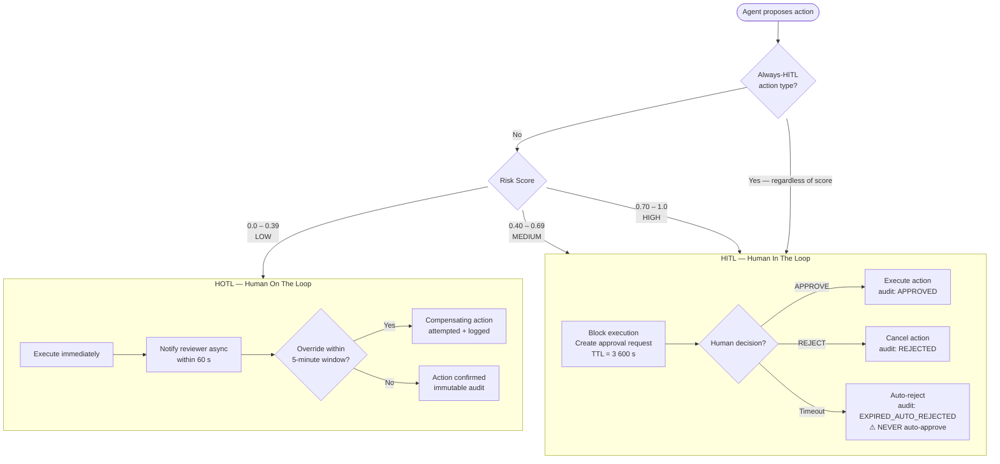

# HITL / HOTL Oversight Model

**Status:** Approved | **Owner:** AI Lead | **Last updated:** 2026-05-24
**ADR references:** ADR-0011 (HITL/HOTL Model)

---

## Definitions

| Term         | Full name         | Definition                                                                                     |
| ------------ | ----------------- | ---------------------------------------------------------------------------------------------- |
| HITL         | Human In The Loop | Agent **blocks** before executing a consequential action; a human must approve or reject first |
| HOTL         | Human On The Loop | Agent executes autonomously; a human monitors in real time and can override within the window  |
| HITL Gateway | —                 | The service component that intercepts proposed actions and manages the approval workflow       |

---

## Decision Model

```
Proposed Action
      │
      ▼
Risk Score (0.0–1.0)
      │
      ├── 0.0–0.39 (LOW)   ──► HOTL — execute, notify reviewer, 5-min override window
      ├── 0.40–0.69 (MEDIUM) ─► HITL — block, request approval, 1-hour timeout
      └── 0.70–1.0 (HIGH)  ──► HITL — block, mandatory approval, 1-hour timeout → reject
```

---

## HITL Specification

### Trigger Conditions

Any action scoring ≥ 0.4 on the risk scorer, AND any action in the following explicit list regardless of score:

| Action category                          | Always HITL | Reason                        |
| ---------------------------------------- | ----------- | ----------------------------- |
| External data exfiltration               | Yes         | Irreversible, regulatory      |
| Financial transaction                    | Yes         | Irreversible, monetary impact |
| Account modification (external)          | Yes         | Irreversible, user impact     |
| Mass notification send                   | Yes         | High-blast, hard to retract   |
| Credential or secret rotation            | Yes         | Security-critical             |
| Production database write                | Yes         | Irreversible, data integrity  |
| Any action on behalf of HIGH-risk entity | Yes         | Regulatory requirement        |

### Approval Workflow

```
1. Agent publishes agent.action.proposed → Kafka → HITL Gateway
2. HITL Gateway creates approval request (ID = request_id, TTL = hitl_timeout_seconds)
3. HITL Gateway notifies reviewer via configured channel
4. Reviewer sees: proposed action, masked context, risk score, audit trail link
5. Reviewer selects: APPROVE or REJECT (with mandatory reason text)
6. HITL Gateway publishes agent.action.approved OR agent.action.rejected → Kafka
7. Agent Service consumes decision and acts accordingly
```

### Timeout Policy

- Default timeout: **3600 seconds (1 hour)**
- On timeout: HITL Gateway publishes `agent.action.expired` → treated as **REJECT**
- Timeout **never** defaults to approval — under any circumstances
- Expired actions are logged in audit with `outcome: EXPIRED_AUTO_REJECTED`

### Reviewer Interface Requirements

The reviewer UI must display:

- Full proposed action details (action type, target, parameters — all masked)
- Risk score and tier with explanation
- Link to full audit trail for this agent session
- Masked context summary (what the agent was told)
- Approve button (requires reason text if HIGH tier)
- Reject button (requires reason text always)
- Time remaining before auto-expiry

---

## HOTL Specification

### Trigger Conditions

Any action scoring < 0.4 that is not in the explicit HITL list above.

### Execution Behaviour

1. Agent executes the action immediately
2. `agent.action.executed` event is published to Kafka
3. Reviewer receives async notification within 60 seconds
4. Reviewer has a **5-minute override window** to initiate reversal
5. After 5 minutes: action is considered confirmed; no override available

### Override Procedure

If a reviewer triggers an override within the window:

1. Reviewer submits override request with reason
2. System attempts compensating action (if reversible)
3. Override and compensating action both logged immutably in audit
4. If action is not reversible: override is logged as advisory; manual remediation required

---

## Decision Flow Diagram



---

## Runtime Enforcement (ADR-0053)

The decision model above is implemented on the orchestrator critical path
(`src/agents/orchestrator/orchestrator.py`) as a fail-closed sequence. Three
modules collaborate:

### 1. Mandatory HITL policy — evaluated BEFORE the numeric risk score

`src/agents/action_policy.py :: requires_mandatory_hitl(action_type, parameters)`
returns `(is_mandatory, reason)`. A numeric risk score can **never** downgrade a
mandatory category. Mandatory triggers: the always-HITL action categories above,
plus production target environment, L1 data classification, bulk operations above
threshold (`entity_count > 100`), feature-flag/autonomy changes, and sandbox-escape
attempts. The triggering `reason` is persisted in audit metadata.

### 2. Graduated autonomy — replaces boolean autonomous mode

`src/shared/feature_flags.py :: get_autonomy_level(action_type, risk_score)`
resolves the level (`NONE → READ_ONLY → TESTS_ONLY → LOW_RISK → MEDIUM_RISK →
FULL`, ADR-0015). The orchestrator decision matrix:

| Condition                                 | Route   | `oversight_mode`       |
| ----------------------------------------- | ------- | ---------------------- |
| `requires_mandatory_hitl` is true         | HITL    | `HITL_MANDATORY`       |
| Tool is **not registered**                | blocked | `BLOCKED_UNREGISTERED` |
| `risk_score ≥ hitl_risk_threshold` (0.4)  | HITL    | `HITL`                 |
| Autonomy level permits the tool           | execute | `HOTL_<level>`         |
| Otherwise (autonomy ceiling insufficient) | HITL    | `HITL`                 |

A `PENDING` HITL response is a **suspension state**, not a failure: the orchestrator
returns `{"status": "waiting_for_human_approval", "hitl_request_id": ...}` and
resumes when `POST /v1/hitl/{id}/decide` delivers a decision. `REJECTED`/`EXPIRED`
raise; only `APPROVED` falls through to execution.

### 3. Tool-registry runtime enforcement (10-step)

`src/agents/tool_executor.py :: ToolExecutor.execute()` is the single choke-point
between routing and execution: normalize → assert registered → validate schema →
`requires_hitl` short-circuit → autonomy permission → per-tool rate limits →
sandbox routing → execute → pre/post/failure audit (execution mode + owner team in
metadata). After HITL approval (`hitl_approved=True`) the `requires_hitl` and
autonomy-permission steps are satisfied, but **registry and sandbox enforcement are
never skipped** — registration and sandbox isolation are absolute (ADR-0048,
ADR-0016).

---

## HOTL Runtime Lifecycle (ADR-0055)

Once an action is routed to HOTL and executed, three components operationalize the
"execute → notify → override window → compensate" model. They are backed by
reversibility metadata declared per tool in `infrastructure/agent-tools/tools.yaml`
(`reversible`, `compensating_action`, `max_hotl_risk_score`, `allowed_autonomy_levels`,
`requires_dual_approval`), loaded and validated at startup (missing fields fail in
production).

### Reversibility gate (before execution)

`src/agents/compensation_registry.py :: can_run_under_hotl(action, risk)` is consulted
by the orchestrator: a **non-reversible** action — or one whose risk exceeds the
tool's `max_hotl_risk_score` — cannot run autonomously under HOTL. It falls back to
HITL (`oversight_mode = "HITL_NON_REVERSIBLE"`) for explicit human approval.

### Notification + override window (after execution)

`src/agents/hotl_monitor.py :: on_hotl_executed()` opens the override window and emits
`agent.action.hotl.notification.sent`, recording latency against the SLO
(`hotl_notification_slo_seconds`, default 60s; breaches are flagged).

### Override + compensation

`src/agents/override_service.py` enforces the window (default 300s) and runs
compensation. Event chain (immutable audit records):

```
agent.action.override.requested        (records actor, reason, timestamp)
  → agent.action.compensation.started
    → agent.action.compensation.succeeded   (compensating action ran)
    | agent.action.compensation.failed       (raised → escalation)
agent.action.confirmed                        (window elapsed, no override)
agent.action.escalation.raised                (failed/absent compensation)
```

- An override after the window closes is rejected (`OverrideWindowExpiredError`).
- A failed or impossible compensation raises `agent.action.escalation.raised` for
  manual remediation.

---

## Risk Scoring Inputs

The risk scorer considers:

| Factor                      | Weight | Notes                                     |
| --------------------------- | ------ | ----------------------------------------- |
| Action type irreversibility | 0.35   | Write/delete > read                       |
| External system affected    | 0.25   | External > internal                       |
| Number of entities affected | 0.20   | Bulk operations score higher              |
| Data sensitivity of payload | 0.15   | L1 PII in scope scores higher             |
| Historical rejection rate   | 0.05   | Learning signal from prior HITL decisions |

Score = weighted sum, clamped to [0.0, 1.0].

---

## Audit Requirements

Every HITL/HOTL decision produces an immutable audit record containing:

```json
{
  "event_id": "<uuid>",
  "request_id": "<uuid>",
  "agent_id": "<string>",
  "action_type": "<string>",
  "risk_score": "<float>",
  "risk_tier": "LOW|MEDIUM|HIGH",
  "oversight_mode": "HITL|HOTL",
  "outcome": "APPROVED|REJECTED|EXPIRED_AUTO_REJECTED|EXECUTED|OVERRIDE",
  "reviewer_id": "<masked>",
  "reason": "<string>",
  "timestamp": "<ISO8601>",
  "trace_id": "<W3C trace id>"
}
```

---

## SLO Targets

| Metric                      | Target               | Alert threshold       |
| --------------------------- | -------------------- | --------------------- |
| HITL reviewer response time | p95 ≤ 30 minutes     | Alert if p95 > 45 min |
| HITL approval queue depth   | ≤ 50 pending         | Alert if > 100        |
| HOTL override rate          | ≤ 2% of HOTL actions | Alert if > 5%         |
| Auto-expiry (timeout) rate  | ≤ 5% of HITL         | Alert if > 10%        |
