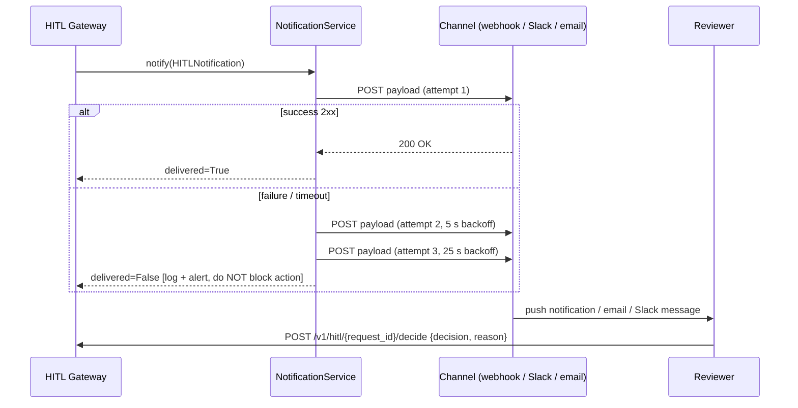

# HITL Notification Channel Spec

**Status:** Approved | **Owner:** AI Lead + Security Lead | **Last updated:** 2026-05-27
**ADR references:** ADR-0011 (HITL/HOTL Model), ADR-0003 (Async API Strategy)

---

## Overview

When a HITL approval request is created, the HITL Gateway must notify one or more
reviewers within 60 seconds. This spec defines the notification contract, webhook payload
schema, retry policy, and the `NotificationService` interface that the gateway depends on.

---

## Notification Flow



**Key invariant:** notification failure MUST NOT block action creation or prevent
the HITL request from entering the store. Undelivered notifications are logged and
an alert is raised, but the approval request remains active with its normal TTL.

---

## NotificationService Interface

```python
from dataclasses import dataclass
from typing import Protocol

@dataclass
class HITLNotification:
    request_id: str
    agent_id: str
    action_type: str
    risk_score: float
    risk_tier: str          # "LOW" | "MEDIUM" | "HIGH"
    context_summary: str    # PII-masked; max 500 chars
    approve_url: str        # deep-link: POST /v1/hitl/{request_id}/decide
    expires_at: str         # ISO8601 — reviewer deadline
    trace_id: str | None

class NotificationService(Protocol):
    async def notify(self, notification: HITLNotification) -> bool:
        """Send the notification. Returns True on confirmed delivery."""
        ...
```

The gateway calls `notify()` as a fire-and-forget background task.
It does not `await` the result inline — the approval request is already stored before
notification is attempted.

---

## Webhook Channel

The default channel. The gateway POSTs a signed JSON payload to the configured URL.

### Configuration (`.env`)

```bash
HITL_WEBHOOK_URL=https://your-reviewer-dashboard/webhooks/hitl
HITL_WEBHOOK_SECRET=<hmac-sha256-secret>   # [REQUIRED] if webhook is enabled
HITL_WEBHOOK_TIMEOUT_SECONDS=10
```

### Payload Schema

```json
{
  "event": "hitl.approval_requested",
  "schema_version": "1.0",
  "request_id": "<uuid>",
  "agent_id": "<string>",
  "action_type": "<string>",
  "risk_score": 0.75,
  "risk_tier": "HIGH",
  "context_summary": "<pii-masked string, ≤ 500 chars>",
  "approve_url": "https://api.example.com/v1/hitl/<request_id>/decide",
  "expires_at": "2026-05-27T15:00:00Z",
  "trace_id": "<w3c-traceparent>"
}
```

### Signature

Every webhook POST includes an `X-HITL-Signature` header:

```
X-HITL-Signature: sha256=<hmac_sha256(secret, body_bytes)>
```

The receiver MUST validate the signature before processing. Reject any request with
a missing or invalid signature.

### Retry Policy

| Attempt | Delay     | Total elapsed |
| ------- | --------- | ------------- |
| 1       | immediate | 0 s           |
| 2       | 5 s       | 5 s           |
| 3       | 25 s      | 30 s          |
| give up | —         | alert raised  |

Backoff uses exponential base-5. No further retries after attempt 3 — the approval
request TTL (3600 s) gives the reviewer time to act directly via the API or dashboard.

---

## Additional Channels (optional, future)

The `NotificationService` protocol allows plug-in channels. Wire them in the FastAPI
lifespan by passing a list to `HITLGateway`:

| Channel           | Env var to enable        | Implementation class         |
| ----------------- | ------------------------ | ---------------------------- |
| Webhook (default) | `HITL_WEBHOOK_URL`       | `WebhookNotificationService` |
| Slack             | `HITL_SLACK_WEBHOOK_URL` | `SlackNotificationService`   |
| Email (SMTP)      | `HITL_SMTP_HOST`         | `EmailNotificationService`   |
| No-op (tests)     | —                        | `NullNotificationService`    |

When multiple channels are configured, `MultiChannelNotificationService` fans out
to all of them concurrently and returns `True` only if at least one succeeds.

---

## Reviewer Dashboard Contract

The reviewer UI must call this endpoint to record a decision:

```
POST /v1/hitl/{request_id}/decide
Content-Type: application/json

{
  "decision": "APPROVE" | "REJECT",
  "approver_id": "<masked reviewer identity>",
  "rationale": "<required text — always for REJECT; required for HIGH tier APPROVE>"
}
```

Response:

- `200 OK` — decision recorded, action will proceed (APPROVE) or be cancelled (REJECT)
- `404` — request_id not found or already decided
- `409` — request already expired (auto-rejected)
- `422` — missing rationale on required decision

---

## Observability

| Metric                              | Type      | Labels                                 |
| ----------------------------------- | --------- | -------------------------------------- |
| `hitl_notifications_sent_total`     | Counter   | `channel`, `outcome=delivered\|failed` |
| `hitl_notification_latency_seconds` | Histogram | `channel`                              |
| `hitl_notification_retry_total`     | Counter   | `channel`, `attempt`                   |

Alert: `HITLNotificationFailure` — any notification that exhausts all retries → P2.

---

## Implementation Reference

`src/agents/hitl_gateway.py` — wire `notification_service` as an optional constructor
argument. Call `asyncio.create_task(self._notification_service.notify(notification))`
immediately after the approval request is persisted to the store.

`src/agents/hitl_notification.py` — implement `WebhookNotificationService` and
`NullNotificationService`. `NullNotificationService` is the default when
`HITL_WEBHOOK_URL` is not set (local dev).
