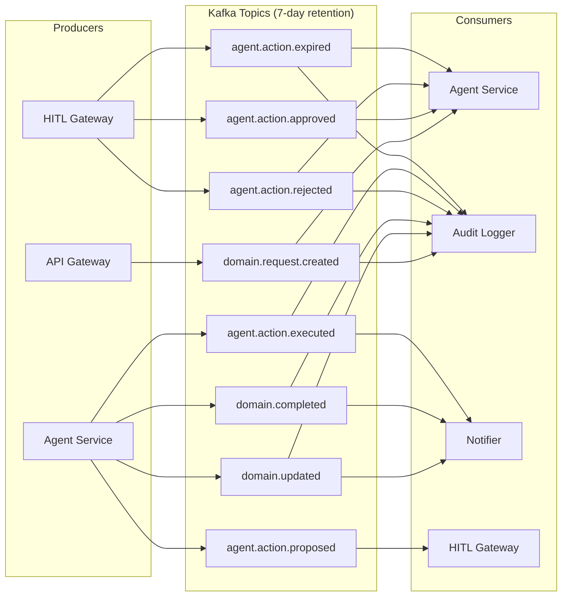

# Async Event Flow Design

**Status:** Approved | **Owner:** Tech Lead | **Last updated:** 2026-05-24
**ADR references:** ADR-0003 (Async API Strategy), ADR-0005 (Message Broker)

---

## Principle

Async-first for high-volume and latency-tolerant flows.
Sync (REST / gRPC) only for:

- Health checks and readiness probes
- HITL approval decisions (human must get immediate feedback)
- Direct user-facing queries requiring immediate response
- Low-latency inter-service calls where broker overhead is prohibitive

---

## Event Topology

| Event                   | Producer      | Consumer(s)          | Schema | Partition key | Retention |
| ----------------------- | ------------- | -------------------- | ------ | ------------- | --------- |
| `domain.created`        | API gateway   | Agent service, Audit | Avro   | user_id       | 7 days    |
| `domain.updated`        | Agent service | Notifier, Audit      | Avro   | user_id       | 7 days    |
| `domain.completed`      | Agent service | Notifier, Audit      | Avro   | user_id       | 7 days    |
| `agent.action.proposed` | Agent service | HITL gateway         | Avro   | agent_id      | 7 days    |
| `agent.action.approved` | HITL gateway  | Agent service        | Avro   | request_id    | 7 days    |
| `agent.action.rejected` | HITL gateway  | Agent service, Audit | Avro   | request_id    | 7 days    |
| `agent.action.executed` | Agent service | Audit, Notifier      | Avro   | agent_id      | 7 days    |
| `agent.action.expired`  | HITL gateway  | Agent service, Audit | Avro   | request_id    | 7 days    |

---

## Delivery Guarantees

| Guarantee              | Implementation                                                            |
| ---------------------- | ------------------------------------------------------------------------- |
| At-least-once delivery | Kafka default; consumers must be idempotent                               |
| Idempotency            | Deduplication key (`event_id` UUID) in every event header                 |
| Schema evolution       | Backward/forward compatible Avro schemas; union types for optional fields |
| Dead Letter Queue      | Every consumer writes unprocessable messages to `<topic>.dlq`             |
| Minimum retention      | 7 days — allows full consumer replay on failure                           |

---

## PII Handling in Events

Per ADR-0012, all events must have PII masked at the **producer** before publish.

```python
# Required pattern in every producer
masked_payload = pii_filter.mask_dict(raw_payload)
producer.send(topic, value=masked_payload, headers={"event_id": str(uuid4())})
```

Events must never contain L1 or L2 PII fields unmasked.

---

## Trace Propagation

W3C TraceContext is injected into every message header:

```python
headers = {
    "traceparent": current_span.get_span_context().trace_id,
    "tracestate":  current_span.get_span_context().trace_state,
    "event_id":    str(event_id),
}
```

Consumers extract and continue the trace:

```python
ctx = propagator.extract(carrier=message.headers)
with tracer.start_as_current_span("consume_event", context=ctx):
    process(message)
```

---

## Dead Letter Queue Policy

| Condition                            | DLQ action                                             |
| ------------------------------------ | ------------------------------------------------------ |
| Schema validation failure            | Move to DLQ immediately (no retry)                     |
| Processing exception (retriable)     | Retry up to 3 times with exponential backoff, then DLQ |
| Processing exception (non-retriable) | Move to DLQ immediately                                |
| DLQ message count > threshold        | Alert on-call (Golden Signal: Saturation)              |

DLQ messages are retained for 30 days. Engineering reviews and replays or discards.

---

## Event Topology Diagram



---

## Observability

| Signal             | Metric                                     | Alert                                     |
| ------------------ | ------------------------------------------ | ----------------------------------------- |
| Consumer lag       | `kafka_consumer_lag`                       | `KafkaConsumerLagHigh` (lag > 10k for 5m) |
| DLQ depth          | `kafka_dlq_messages_total`                 | Alert if DLQ grows > 100 messages         |
| End-to-end latency | publish timestamp → consumer ack timestamp | Tracked in CUJ-001 dashboard              |
| Event throughput   | `kafka_messages_produced_total`            | `ZeroRequestRate` if drops to 0           |
