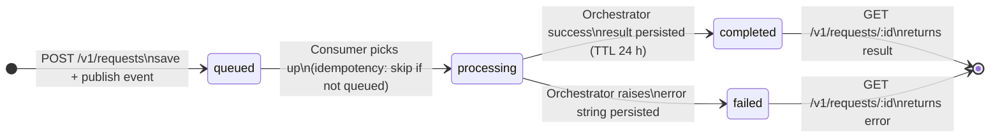

# Request Pipeline Spec

**Status:** Approved | **Owner:** Tech Lead | **Last updated:** 2026-05-26
**ADR references:** ADR-0003 (Async API Strategy), ADR-0005 (Message Broker Selection),
ADR-0009 (Caching Strategy), ADR-0011 (HITL/HOTL Model), ADR-0012 (PII Masking Strategy)

---

## Problem

`POST /v1/requests` accepts submissions but publishes no events and stores no state.
`GET /v1/requests/{id}` always returns 404. CUJ-001 (the core user journey) is non-functional.

---

## Solution

Wire the async pipeline in three parts:

1. **Producer** — `POST /v1/requests` saves initial state and publishes `domain.request.created`
2. **Consumer** — background asyncio task reads events, runs `AgentOrchestrator`, writes result
3. **Poller** — `GET /v1/requests/{id}` reads state from store and returns current status

In production, the consumer runs as a separate Deployment. In this template it runs as an
asyncio background task in the FastAPI lifespan for self-contained demonstration.

---

## Request State Model

| State        | Meaning                                       |
| ------------ | --------------------------------------------- |
| `queued`     | Event published; consumer not yet started     |
| `processing` | Consumer received event; orchestrator running |
| `completed`  | Orchestrator finished; result available       |
| `failed`     | Orchestrator raised; error message stored     |

Transitions: `queued → processing → completed | failed`

```python
@dataclass
class RequestState:
    request_id: str
    status: str          # "queued" | "processing" | "completed" | "failed"
    created_at: datetime
    updated_at: datetime
    result: dict | None  # populated on completed
    error: str | None    # populated on failed
```

---

## Broker Contract

```python
class EventBrokerProtocol(Protocol):
    async def publish(self, topic: str, payload: dict, key: str | None = None) -> None: ...
```

`KafkaEventBroker` wraps `aiokafka.AIOKafkaProducer`:

- Serializes the full event envelope to JSON bytes
- `acks="all"` and `enable_idempotence=True` per ADR-0005
- `start()` / `stop()` lifecycle methods for FastAPI lifespan
- Satisfies the same interface `HITLGateway.broker` expects; HITLGateway is now wired to a real broker

`InMemoryBroker` (tests only):

- Captures events in `self.published: list[dict]`
- No aiokafka dependency; safe for all unit tests

`build_envelope(event_type, payload, trace_id) -> dict` builds the mandatory 7-field envelope
per `specs/api/async-api-design.md`: `event_id`, `event_type`, `schema_version`, `produced_at`,
`trace_id`, `producer_service`, `payload`.

---

## Request Store Contract

```python
class RequestStoreProtocol(Protocol):
    async def save(self, state: RequestState) -> None: ...
    async def get(self, request_id: str) -> RequestState | None: ...
```

`InMemoryRequestStore` — dict-backed; for tests and local dev without Redis.

`RedisRequestStore` — mirrors `HITLRedisStore` pattern:

- Key: `{request_redis_key_prefix}:state:{request_id}`
- TTL: `request_result_ttl_hours × 3600` seconds
- Serialization: JSON (consistent with rest of codebase)

---

## Consumer Requirements

Per `specs/api/async-api-design.md` §Consumer Implementation Requirements:

1. **Idempotency** — skip events where `store.get(request_id).status != "queued"` (duplicate delivery)
2. **State transition** — update to `processing` before calling orchestrator
3. **Orchestration** — instantiate `AgentOrchestrator` with full dependency stack; call `run()`
4. **Success path** — update state to `completed`, persist result dict
5. **Failure path** — update state to `failed`, persist error string; log and continue (no crash)
6. **OTel span** — create child span with `event_id` and `trace_id` attributes
7. **DLQ** — messages that fail all retries are published to `domain.request.dlq`; see §DLQ below

---

## API Contract Changes

### `POST /v1/requests` — 202 Accepted (response shape unchanged, now functional)

1. Generate `request_id` (UUID v4)
2. Mask PII via `mask_dict()` (ADR-0012)
3. `await store.save(RequestState(request_id, status="queued", ...))`
4. `await broker.publish("domain.request.created", build_envelope(...))`
5. Return `RequestOut(request_id, status="queued", ...)`

503 if `app.state.request_store` or `app.state.broker` is absent.

### `GET /v1/requests/{id}` — was always 404, now functional

1. `state = await store.get(request_id)`
2. 404 if `state is None`
3. Return `RequestStatusResponse(request_id, status, created_at, updated_at, result, error, message)`

New response model:

```python
class RequestStatusResponse(BaseModel):
    request_id: str
    status: str
    created_at: datetime
    updated_at: datetime
    result: dict | None = None
    error: str | None = None
    message: str
```

---

## Configuration Additions

Added to `src/shared/config.py`:

```python
request_redis_key_prefix: str = "request"
request_result_ttl_hours: int = 24
```

---

## Request State Diagram



---

## DLQ — Dead Letter Queue (REM-012)

Failed messages that exhaust all retry attempts are routed to `domain.request.dlq`.

### Retry policy

```
kafka_consumer_max_retries = 3        # attempts before DLQ routing
kafka_consumer_retry_backoff_seconds = 1.0  # base delay, doubles each attempt
```

Backoff schedule: 1 s → 2 s → 4 s (total wait: 7 s before DLQ).

### DLQ envelope

The original event envelope is re-published to `domain.request.dlq` with one extra field:

```json
{
  "event_id": "<original>",
  "event_type": "domain.request.created",
  "...",
  "dlq_error": "RuntimeError: LLM unavailable after 3 attempts"
}
```

### Offset safety

`enable_auto_commit=False`. The Kafka offset is committed **only after** `_handle()` returns,
whether the message succeeded or was routed to the DLQ. This prevents:

- **Silent loss**: auto-commit advancing the offset before processing completes.
- **Infinite reprocessing**: failed messages stay in the DLQ topic, not the original topic.

### Consumer heartbeat (REM-013)

`CONSUMER_HEARTBEAT_TIMESTAMP` (Gauge) is set to the current epoch after each committed message.
Alert: `time() - consumer_heartbeat_timestamp_seconds > 300 AND kafka_consumer_lag > 0`

Runbook: `docs/sre/runbooks/dlq-accumulating.md`

---

## Non-Goals (P4 scope boundary)

- Avro / Schema Registry serialization — existing code uses JSON; Avro is infrastructure-level
- DLQ consumer (replay API) — document in runbook; automated replay is a future item
- `domain.result.completed` publish — consumer logs completion; event publish is a future item
- Separate worker process / Kubernetes Deployment manifests
